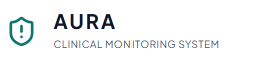
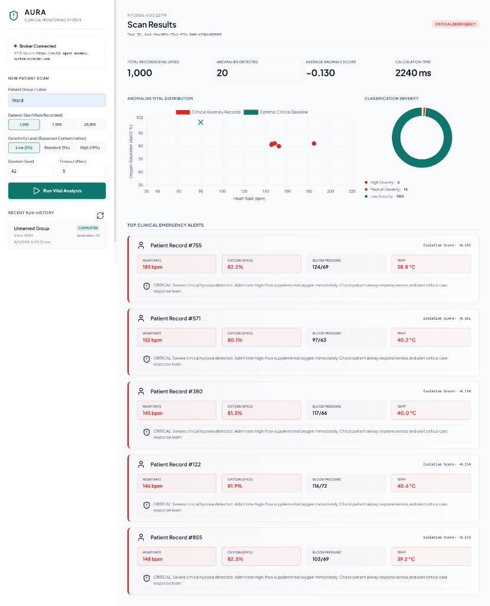
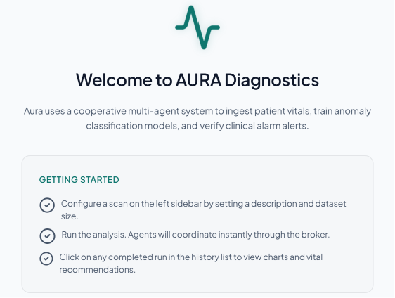
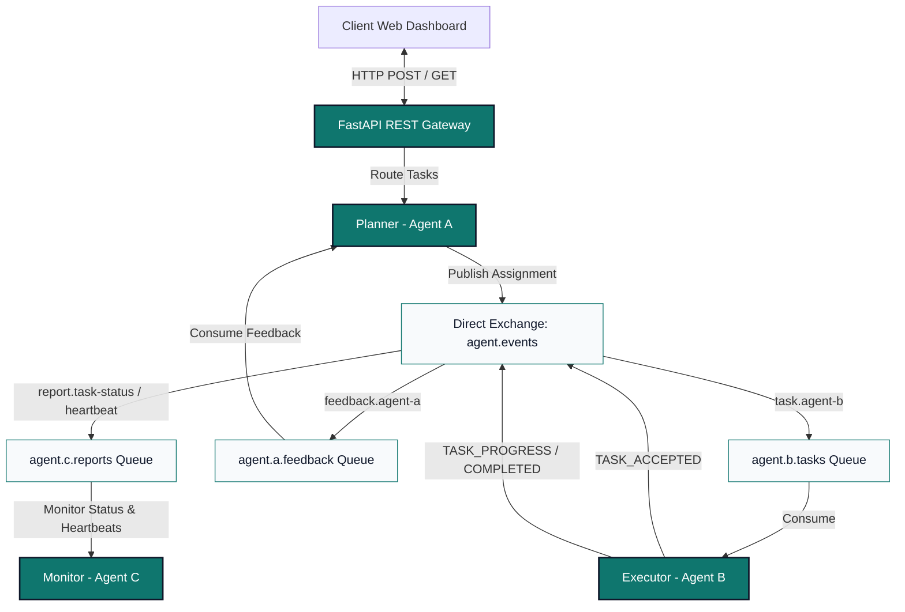
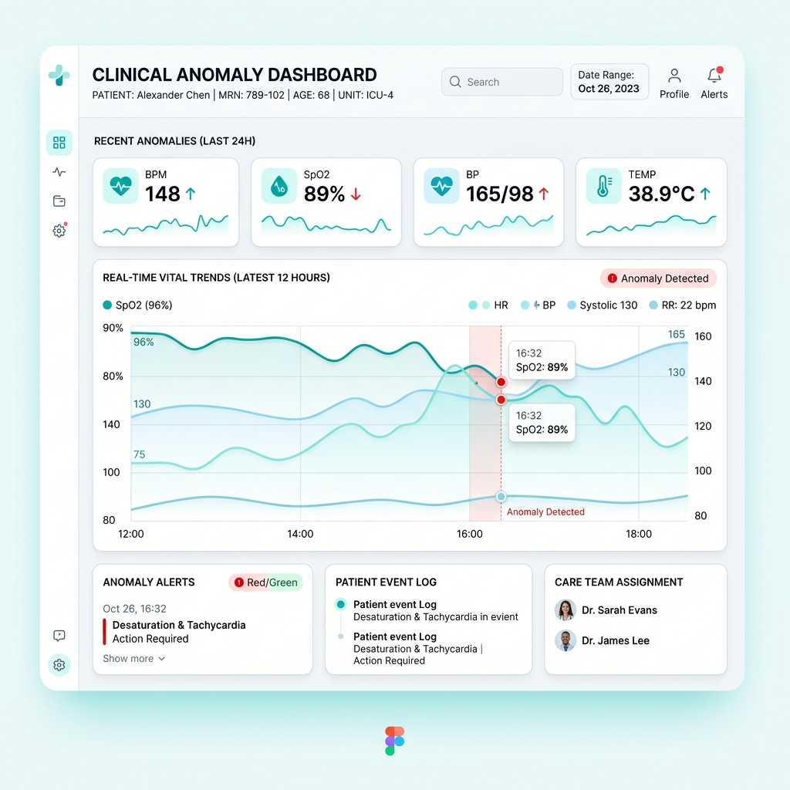

<p align="center">
  
</p>

<h1 align="center">AURA</h1>

<p align="center">
  <strong>Asynchronous Diagnostic Engine & Telemetry Monitoring Dashboard</strong>
</p>

<p align="center">
  <a href="https://github.com/Abhishektiwari050/multi-agent-anomaly-system/actions/workflows/ci.yml"></a>
  <a href="https://github.com/astral-sh/ruff"></a>
  <a href="https://opensource.org/licenses/MIT"></a>
  <a href="https://www.python.org/downloads/"></a>
</p>

<p align="center">
  
</p>


---

## 🌟 Executive Summary

This system implements an advanced clinical telemetry monitoring solution leveraging a **decoupled, multi-agent architecture** over a distributed message broker. By simulating multivariate vital signs (Heart Rate, $SpO_2$, Blood Pressure, Temperature, Respiratory Rate, Glucose) and training **unsupervised Isolation Forest models**, the system isolates critical patient distress patterns in real-time. 

Designed for scalability, high availability, and clinical precision, the platform coordinates planner, executor, and watchdog monitors asynchronously using AMQP event queues, wrapping compute nodes with robust dead-letter recovery and active process orchestration.

<p align="center">
  
</p>

---

## 🛠️ System Architecture

The core topology utilizes a centralized process controller (`supervisord`) orchestrating decoupled agent containers, routing communications through a central **CloudAMQP RabbitMQ** instance:



### Decoupled Routing Topology:
*   **FastAPI REST Gateway**: Serves the telemetry dashboard and registers task requests (`POST /tasks/analyze`).
*   **Planner (Agent A)**: Oversees parameters generation, initializes task tracing metadata (correlation IDs), publishes assignment events, and receives final task telemetry reports.
*   **Executor (Agent B)**: The compute-heavy engine. Generates synthetic vital datasets, trains an Isolation Forest model to partition multivariate outliers, and constructs telemetry diagnostics.
*   **Monitor (Agent C)**: Watchdog service. Audits execution progress, registers process heartbeats from active agents, and raises critical severity alarms if any node disconnects.

---

## 🚀 Key Features

| Feature | Tech Stack | Clinical/Operational Value |
|:---|:---|:---|
| **Multivariate Anomaly Detection** | `scikit-learn` (Isolation Forest) | Detects clinical distress indicators by identifying multi-dimensional deviations (e.g. elevated heart rate combined with low $SpO_2$). |
| **Event-Driven Coordination** | `RabbitMQ` & `pika` | Completely decouples execution threads from REST endpoints, avoiding server blocking during heavy AI processing. |
| **Standalone Executor Package** | `Docker` & `.env` | A self-contained clinical execution agent folder ([/execution-agent](file:///C:/Users/abhis/.gemini/antigravity/scratch/multi-agent-anomaly-system/execution-agent/)) is packaged for independent cloud deployment. |
| **Heartbeat Watchdog** | `threading` & `loguru` | Separates socket connections to publish concurrent process statuses every 30 seconds, allowing Agent C to monitor health. |
| **Dead-Letter Recovery (DLQ)** | `x-dead-letter-exchange` | Unhandled task exceptions auto-increment retries and gracefully route to `agent.dlq` after 3 failures to prevent message loss. |
| **Light-Theme Medical UI** | `HTML5`, `CSS3`, `Chart.js` | Built in clinical off-white (`#F8FAFC`) with accessible high-contrast layouts conforming to clinical dashboard rules. |

---

## 📄 Message Contracts (JSON Schema)

Decoupled communication requires unified, immutable contracts. All AMQP messages utilize the `MessageEnvelope` format:

```json
{
  "message_id": "8e32ea70-e67c-473d-8182-d249f7e8a931",
  "sender_id": "agent-a",
  "receiver_id": "agent-b",
  "message_type": "TASK_ASSIGNMENT",
  "timestamp": "2026-07-09T07:18:40.125Z",
  "correlation_id": "session-42b781",
  "priority": 2,
  "routing_key": "task.agent-b",
  "payload": {
    "task_id": "task-df38190",
    "parameters": {
      "total_records": 7000,
      "contamination": 0.05,
      "random_seed": 42
    }
  },
  "metadata": {
    "retry_count": 0,
    "max_retries": 3,
    "routing_path": ["agent-a"]
  }
}
```

---

## ⚙️ Setup and Installation

### 1. Clone & Setup Environment
```bash
git clone https://github.com/Abhishektiwari050/multi-agent-anomaly-system.git
cd multi-agent-anomaly-system
python -m venv .venv
source .venv/bin/activate  # On Windows: .venv\Scripts\activate
pip install -r requirements.txt
```

### 2. Configure Credentials
Copy the environment template and insert your broker connection parameters:
```bash
cp .env.example .env
```

### 3. Running Locally
Spin up the coordinated environment (FastAPI REST Gateway, Planner, Executor, Monitor) locally using supervisor:
```bash
supervisord -c supervisord.conf
```
You can view active tasks and trigger simulations by loading `http://localhost:8000` in your browser:

<p align="center">
  
</p>


### 4. Running the Standalone Executor Agent
You can deploy the Executor Agent in isolation (e.g. as a background worker on Render, AWS ECS, or GCP Cloud Run):
```bash
cd execution-agent
pip install -r requirements.txt
python main.py
```

---

## 🧪 Verification & CI/CD pipeline

Our automated quality pipeline runs on Github Actions, verifying styling, types, and test validity on every commit:

*   **Linter & Formatter**: `ruff check .` and `ruff format --check .`
*   **Static Typing**: `mypy --ignore-missing-imports shared api agents execution-agent`
*   **Test Runner**: `pytest --cov=shared --cov=api --cov=agents --cov-report=term-missing`

To run testing assertions locally:
```bash
pytest
```

---

## 🎨 AI Development Disclosure

*   **System Ideation (Claude)**: Worked with Claude to select the technology stack (FastAPI, RabbitMQ direct routing, and Supervisord orchestrator).
*   **System Implementation & Debugging (Gemini / Antigravity)**: Code generation, debugging, light-theme UI creation, separate connection threading for AMQP heartbeats, Render SSL handshake configurations, and dynamic isolation tests were fully implemented by Gemini.

---
**Developer**: Abhishek Tiwari
