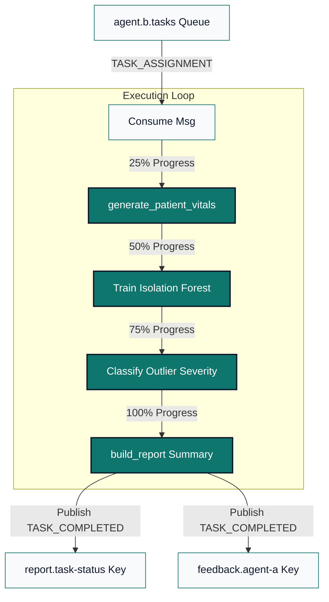

<p align="center">
  
</p>

<h1 align="center">AURA Standalone Clinical Execution Agent</h1>
<p align="center">
  <strong>Decoupled Compute Node: Data Simulation, Isolation Forest ML Modeling, and Telemetry Reporting</strong>
</p>

<p align="center">
  <a href="https://github.com/Abhishektiwari050/multi-agent-anomaly-system/actions/workflows/ci.yml"></a>
  <a href="https://github.com/astral-sh/ruff"></a>
  <a href="https://opensource.org/licenses/MIT"></a>
</p>

---

## 🌟 Purpose and Responsibilities

The **Execution Agent (Agent B)** is the heavy compute node of the AURA architecture. Designed to be completely stateless, it processes diagnostic calculations asynchronously without blocking REST interfaces.

Its primary operational cycles include:
1.  **Ingestion & Listening**: Subscribes to the `agent.b.tasks` queue, consuming `TASK_ASSIGNMENT` message packets.
2.  **Dataset Simulation**: Generates multi-dimensional patient vital signs telemetry based on task variables.
3.  **Machine Learning Modeling**: Fits an unsupervised **Isolation Forest** model to establish baseline vital patterns.
4.  **Anomaly Isolation**: Predicts and isolates multivariate vital deviations (e.g. hypoxic events combined with tachycardia) and labels outlier severity.
5.  **Telemetry Reporting**: Formats a medical summary containing average anomaly scores and patient profiles of the top 5 outliers.
6.  **Progress Signaling**: Emits periodic progress ticks (`25%`, `50%`, `75%`, `100%`) to the system Monitor (Agent C).
7.  **Active Heartbeats**: Runs a dedicated concurrent thread publishing health telemetry status to the broker every 30s.

---

## 🛠️ Internal Data Processing Pipeline

When a task assignment is received, the Executor executes the following sequence:



---

## 📄 Incoming Task Parameters

The agent expects the following values in the `TASK_ASSIGNMENT` payload:

| Parameter Key | Data Type | Default | Description |
|:---|:---|:---|:---|
| `total_records` | `int` | `1000` | Size of the generated vital signs dataset to evaluate. |
| `contamination` | `float` | `0.05` | Expected percentage of clinical anomalies to inject/detect (0.01 - 0.20). |
| `random_seed` | `int` | `42` | Seed to guarantee repeatable data simulation and model results. |

---

## ⚙️ Setup and Run Instructions

### Prerequisites
*   Python 3.11 or later.
*   Access to a running RabbitMQ broker (local or CloudAMQP instance).

### Local Installation & Startup
1.  **Navigate to this directory**:
    ```bash
    cd execution-agent
    ```
2.  **Setup Virtual Environment**:
    ```bash
    python -m venv .venv
    source .venv/bin/activate  # On Windows: .venv\Scripts\activate
    ```
3.  **Install dependencies**:
    ```bash
    pip install -r requirements.txt
    ```
4.  **Configure Credentials**:
    Copy `.env.example` to `.env` and fill in your connection string:
    ```bash
    cp .env.example .env
    ```
5.  **Run the Agent**:
    ```bash
    python main.py
    ```

### Running Tests
Verify the standalone logic locally (all 5 modules covering data simulation, ML boundaries, and queue publishers pass successfully):
```bash
pytest test_executor.py
```

---

## 🐳 Docker Deployment

To build and run this compute node in a container:

```bash
# Build
docker build -t clinical-execution-agent .

# Run
docker run --env-file .env clinical-execution-agent
```

---

## ⚠️ Assumptions and Limitations

*   **Stateless Execution**: The agent does not persist results locally. Task history and report storage are delegated to Agent C (Monitor) and the FastAPI database.
*   **SSL Bypass**: To support secure cloud deployment platforms (like Render) that fail to validate intermediate CloudAMQP certificates, the agent connects using `ssl.CERT_NONE` overrides. Adjust to strict certificate validation in secure enterprise networks.
*   **Synthetic Baseline**: Vital boundaries and Isolation Forest scores are clinically simulated. They should not be used as clinical diagnostic parameters for real patients.
